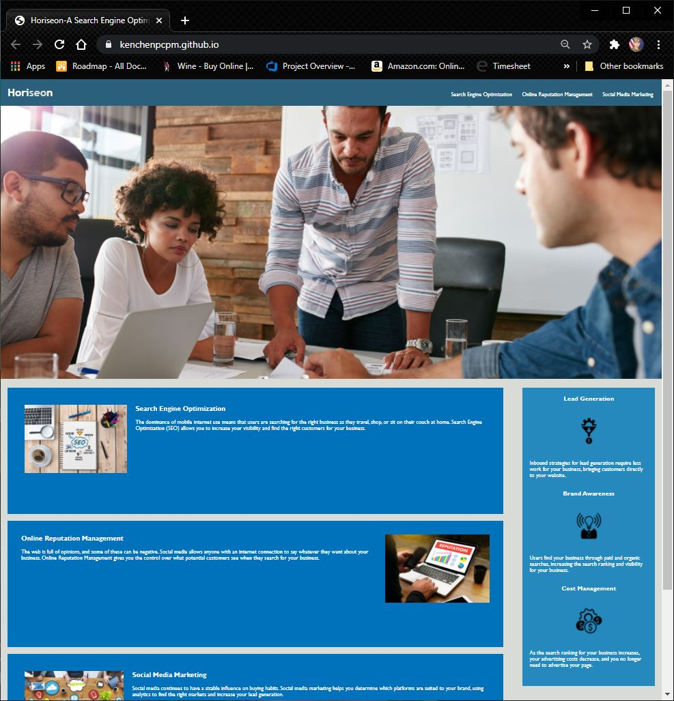
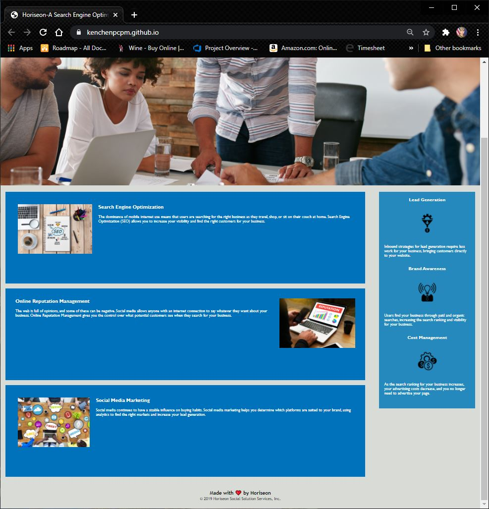

# KenChenWk1Homework
Week 1 Homework 
-Download codes for both HTML & CSS, download images and rename to what they are called in the HTML code 
-Adding ID for clicking+leading to the detail 
-Correct the semantic structure 
-Input: header, nav, main, article, section, aside 
-GitHub url= https://github.com/kenchenpcpm/KCWK1Homework/ 
-Gitpage url= https://kenchenpcpm.github.io/KCWK1Homework/ 
 
 
